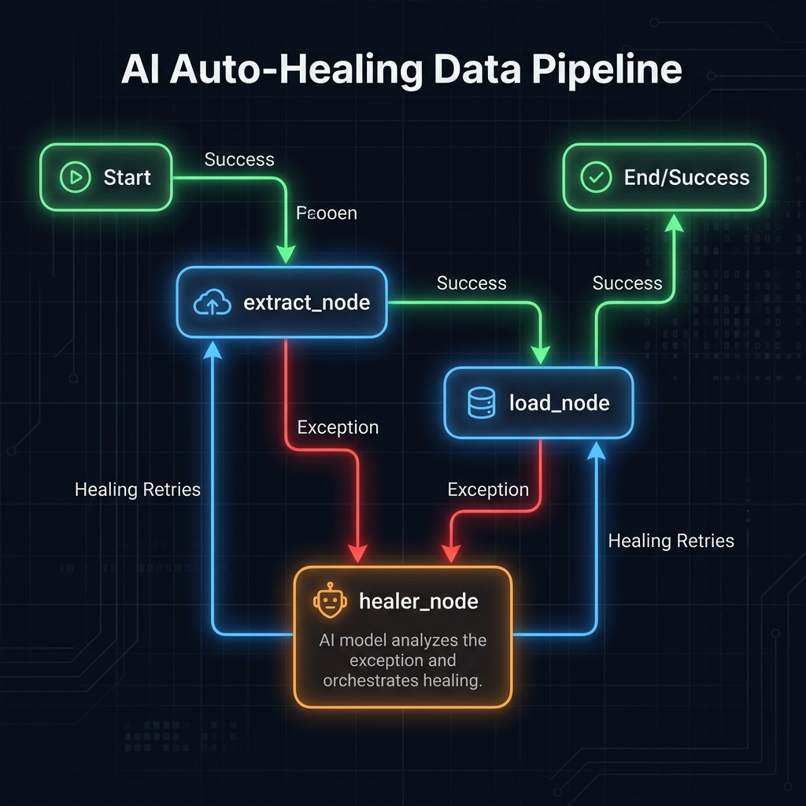

# Research: AI-Driven Auto-Healing Ingestion Pipeline using LangGraph & LangChain

This research document outlines the architecture, data structures, and code templates for implementing an agentic, stateful auto-healing mechanism for your PySpark data ingestion pipeline using **LangGraph** and **LangChain**.

---

## 1. Architectural Concept

In a traditional ETL pipeline, any error (e.g., malformed csv, datatype mismatch, constraint violation on load) crashes the run. In an **agentic pipeline**, we represent the stages as nodes in a graph. If a node fails:
1. The exception details and data samples are captured in the graph's **State**.
2. A **Conditional Edge** routes the execution to an **AI Healer Node**.
3. The healer uses a LLM via **LangChain** to generate a structured recovery plan (actions).
4. The healer node applies these fixes directly to the DataFrame or execution state.
5. The graph routes back to the failed node to retry the operation.



*View full resolution diagram: [auto_healing_pipeline_diagram.png](file:///Users/jenishzinzuvadiya/Desktop/Jenish AI/Vanguard Ingestion Engine/Vanguard-Ingestion-Engine/research/auto_healing_pipeline_diagram.png)*

---

## 2. Setting Up Python Dependencies

Add the following to your `pyproject.toml` or install them in your virtual environment:

```bash
pip install langgraph langchain-google-genai langchain-core pydantic
```

* **`langgraph`**: Manages the state, nodes, edges, and compilation of the workflow.
* **`langchain-google-genai`**: Provides integration with Google Gemini models (e.g., `ChatGoogleGenerativeAI`).
* **`langchain-core`**: Core abstractions for prompts, messages, and structured output parsing.
* **`pydantic`**: Used to define structured outputs for the LLM response.

---

## 3. Defining the Graph State

The state acts as a shared, mutable memory context throughout the execution run. In LangGraph, we define it as a subclass of `TypedDict` or a Pydantic model.

```python
from typing import TypedDict, List, Optional, Any
from pyspark.sql import DataFrame

class PipelineState(TypedDict):
    file_path: str                  # Path to the source CSV file
    df: Optional[DataFrame]         # The active PySpark DataFrame being processed
    error: Optional[str]            # Details of the last raised exception
    last_failed_step: Optional[str] # Which step failed: "extract" or "load"
    heal_attempts: int              # Counter to prevent infinite loops
    max_attempts: int               # Limit on healing retries
    heal_history: List[dict]        # Log of AI-generated healing actions applied
    status: str                     # Pipeline status: "pending", "success", "failed"
```

---

## 4. Structured Output with LangChain

Rather than asking the LLM to output freeform text or code, we restrict its response to a list of structured healing commands. This ensures safety and reliability.

### Step A: Define the Schema using Pydantic
```python
from pydantic import BaseModel, Field
from typing import List, Dict, Any, Literal

class HealingAction(BaseModel):
    action_type: Literal[
        "fill_null",       # Fill null/missing values in a column
        "cast_column",     # Safely cast column to another type (with cleaning)
        "replace_value",   # Replace specific bad strings (e.g. 'N/A' or '$12')
        "truncate_string", # Truncate string to match VARCHAR lengths
        "drop_row"         # Drop rows that are corrupted
    ] = Field(description="The category of fix to apply to the DataFrame.")
    
    column: str = Field(description="The name of the target column to modify.")
    
    parameters: Dict[str, Any] = Field(
        default_factory=dict,
        description="Key-value parameters for the action. E.g. {'fill_value': 0.0} or {'target_type': 'double', 'remove_chars': '$'}"
    )

class HealingRecipe(BaseModel):
    error_analysis: str = Field(description="Analysis of what caused the exception.")
    explanation: str = Field(description="Step-by-step description of how the actions fix it.")
    actions: List[HealingAction] = Field(description="Ordered list of actions to perform on the DataFrame.")
```

### Step B: Instantiate the LLM with Structured Output
```python
from langchain_google_genai import ChatGoogleGenerativeAI

# Initialize the Gemini model
llm = ChatGoogleGenerativeAI(
    model="gemini-2.5-flash",
    temperature=0,
    google_api_key="YOUR_GEMINI_API_KEY"  # Or read from os.environ
)

# Bind the structured output schema
structured_llm = llm.with_structured_output(HealingRecipe)
```

---

## 5. Implementing Graph Nodes

Each node is a Python function that takes the current state, performs operations, and returns an updated dictionary containing state changes.

### Extract Node
```python
import traceback
from pyspark.sql.utils import AnalysisException

def extract_node(state: PipelineState) -> dict:
    print("\n--- Executing Extract Node ---")
    file_path = state["file_path"]
    
    try:
        # Assuming you inject your SparkSession or import your pipeline class
        # Here we mock the pipeline ingestion extract
        # raw_df = pipeline.extract(file_path)
        
        # If successfully extracted:
        # return {"df": raw_df, "error": None}
        pass
    except Exception as e:
        error_msg = f"Extraction failed: {str(e)}\n{traceback.format_exc()}"
        print(f"Error captured during extract: {e}")
        return {
            "error": error_msg,
            "last_failed_step": "extract"
        }
```

### Load Node
```python
def load_node(state: PipelineState) -> dict:
    print("\n--- Executing Load Node ---")
    df = state["df"]
    
    if df is None:
        return {"error": "DataFrame is empty, cannot load.", "last_failed_step": "load"}
        
    try:
        # Perform Spark JDBC load operation
        # df.write.jdbc(...)
        
        # If load succeeds:
        return {"status": "success", "error": None}
    except Exception as e:
        error_msg = f"Load failed: {str(e)}\n{traceback.format_exc()}"
        print(f"Error captured during load: {e}")
        return {
            "error": error_msg,
            "last_failed_step": "load"
        }
```

### AI Healer Node
The healer node sends the context to the LLM, gets the actions, and then dynamically applies transformations to the PySpark DataFrame based on the action commands.

```python
from pyspark.sql import functions as F

def apply_actions_to_df(df: DataFrame, actions: List[HealingAction]) -> DataFrame:
    """Dynamically applies PySpark DataFrame modifications based on structured AI actions."""
    for action in actions:
        col_name = action.column
        act_type = action.action_type
        params = action.parameters
        
        print(f"Applying fix: {act_type} on column '{col_name}' with parameters {params}")
        
        if act_type == "fill_null":
            fill_val = params.get("fill_value")
            df = df.fillna({col_name: fill_val})
            
        elif act_type == "replace_value":
            old_val = params.get("old_value")
            new_val = params.get("new_value")
            df = df.withColumn(col_name, F.when(df[col_name] == old_val, new_val).otherwise(df[col_name]))
            
        elif act_type == "cast_column":
            target_type = params.get("target_type", "double")
            clean_chars = params.get("clean_chars", []) # e.g., ["$", "%", ","]
            
            col_expr = df[col_name]
            # Strip unwanted characters before casting
            for char in clean_chars:
                col_expr = F.regexp_replace(col_expr, f"\\{char}", "")
            
            df = df.withColumn(col_name, col_expr.cast(target_type))
            
        elif act_type == "truncate_string":
            max_len = params.get("max_length", 255)
            df = df.withColumn(col_name, F.substring(df[col_name], 1, max_len))
            
        elif act_type == "drop_row":
            # Filter out rows matching criteria
            # E.g., dropping rows where this column is null
            df = df.filter(df[col_name].isNotNull())
            
    return df

def healer_node(state: PipelineState) -> dict:
    print("\n--- Executing AI Healer Node ---")
    error = state["error"]
    df = state["df"]
    
    # Extract data sample to help LLM understand the formatting issue
    sample_data = ""
    if df is not None:
        # Get schema fields and top 5 rows
        schema_fields = df.schema.simpleString()
        rows = df.limit(5).collect()
        sample_data = f"Schema: {schema_fields}\nSample Rows:\n" + "\n".join([str(r.asDict()) for r in rows])
        
    prompt = f"""
    You are an AI Data Healer Agent. An ingestion pipeline has failed.
    
    FAILED STEP: {state['last_failed_step']}
    ERROR DETAILS:
    {error}
    
    DATAFRAME CONTEXT:
    {sample_data}
    
    Identify the issue and provide a HealingRecipe consisting of a sequence of HealingActions.
    Only output actions that correspond to the supported operations: fill_null, cast_column, replace_value, truncate_string, drop_row.
    """
    
    # Request Structured Output from LangChain
    recipe: HealingRecipe = structured_llm.invoke(prompt)
    
    print(f"AI Analysis: {recipe.error_analysis}")
    print(f"Proposed Healing Strategy: {recipe.explanation}")
    
    # Apply actions to Spark DataFrame
    healed_df = apply_actions_to_df(df, recipe.actions)
    
    return {
        "df": healed_df,
        "error": None, # Reset error to trigger retry
        "heal_attempts": state["heal_attempts"] + 1,
        "heal_history": state["heal_history"] + [recipe.model_dump()]
    }
```

---

## 6. Graph Routing and Compilation

We need a router function to decide whether to stop or continue when an error is encountered.

```python
from langgraph.graph import StateGraph, END

# Conditional routing edge
def route_after_step(state: PipelineState) -> str:
    if state["error"] is not None:
        if state["heal_attempts"] < state["max_attempts"]:
            return "healer"
        else:
            return "fail"
    else:
        # If extract succeeded, move to load. If load succeeded, end.
        if state["last_failed_step"] is None:
            # First success must be extraction
            return "load"
        else:
            # Succeeded loading
            return "end"

# Compile graph
workflow = StateGraph(PipelineState)

# Add nodes
workflow.add_node("extract", extract_node)
workflow.add_node("load", load_node)
workflow.add_node("healer", healer_node)

# Set entry point
workflow.set_entry_point("extract")

# Add conditional edges
workflow.add_conditional_edges(
    "extract",
    route_after_step,
    {
        "load": "load",
        "healer": "healer",
        "fail": END
    }
)

workflow.add_conditional_edges(
    "load",
    route_after_step,
    {
        "end": END,
        "healer": "healer",
        "fail": END
    }
)

# Healer nodes routes back to the failed node to retry
def route_back(state: PipelineState) -> str:
    return state["last_failed_step"]

workflow.add_conditional_edges(
    "healer",
    route_back,
    {
        "extract": "extract",
        "load": "load"
    }
)

app = workflow.compile()
```

---

## 7. Invoking the Graph

To run the pipeline, invoke the compiled graph with an initial state:

```python
initial_state = {
    "file_path": "Data/pipeline_ingress_batches/world_energy_consumption_batch_1.csv",
    "df": None,
    "error": None,
    "last_failed_step": None,
    "heal_attempts": 0,
    "max_attempts": 3,
    "heal_history": [],
    "status": "pending"
}

# Run the graph
final_state = app.invoke(initial_state)

print("\n--- Pipeline Execution Summary ---")
print(f"Final Status: {final_state['status']}")
print(f"Total Healing Attempts: {final_state['heal_attempts']}")
print(f"Applied fixes: {final_state['heal_history']}")
```
